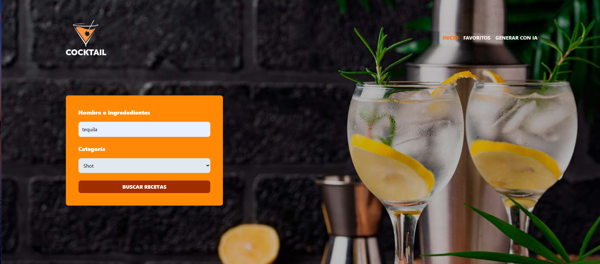
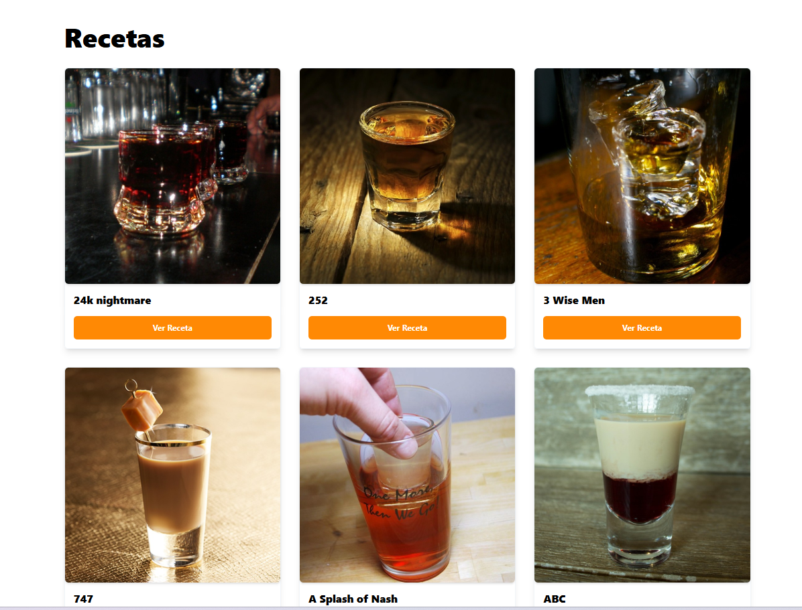

# 🍹 Drink Project with React + TypeScript + Zustand + Axios + Zod + Vite + OpenRouter AI
---


---
## 🍸 Descripción

Aplicación web moderna desarrollada con **React + TypeScript + Zustand + Axios + Zod + Vite + OpenRouter AI**, que permite **consultar y descubrir recetas de bebidas** a través de una REST API pública.  

La app ofrece una experiencia **interactiva y elegante**, donde el usuario puede explorar distintas categorías de bebidas, ver detalles completos (ingredientes, preparación, imágenes) y hasta **usar IA para obtener recomendaciones personalizadas** de recetas mediante **OpenRouter AI**.

---

## 🚀 Funcionalidades principales

- 🍸 **Búsqueda de recetas** por ingredientes o categorías (cocktails, coffee, shots, beers, etc).  
- 🧠 **Recomendaciones con IA (OpenRouter)**: genera recetas sugeridas según el tipo de bebida deseado.  
- 🧾 **Listado de categorías dinámico** consumido desde la API.  
- 🔄 **Detalle de recetas** con ingredientes e instrucciones actualizadas sin recargar la página.  
- ⚙️ **Validación estricta** de datos con **Zod**.  
- 💾 **Gestión de estado global** con **Zustand**.  
- 🧭 **Navegación entre páginas** usando **React Router**.  
- 🎨 **UI moderna, accesible y responsiva** con **Headless UI + Heroicons + CSS**.  
- 🤖 **Organización profesional del proyecto** con directorio `layout` para estructurar vistas y rutas.  

---

## ⚛️ Hooks de React aplicados

- 🧠 `useState` → Manejo de estados locales (inputs, filtros, estados de carga, etc).  
- ⚡ `useEffect` → Peticiones a la API de bebidas y actualización automática de resultados.  
- 📦 `useMemo` → Optimización del renderizado de listas de recetas.  
- 🪄 `useRef` → Referencias a elementos del DOM para control de modales y animaciones.  

---

## 🔹 Hooks de **Zustand**

- `useAppStore` → Estado global centralizado para la gestión de resultados, filtros y modales.  

---

## 🔹 Uso de **Axios + Zod + OpenRouter AI**

- 🔍 **Axios** → Cliente HTTP para consumo de API REST.  
- 🧾 **Zod** → Validación y tipado de respuestas antes de su renderizado.  
- 🤖 **OpenRouter AI** → Integración de modelos de IA para búsquedas y recomendaciones de recetas inteligentes.  

---

## 📂 Estructura del proyecto

```
├─ components/   # Componentes reutilizables (DrinkCard, Header, Modal, Notification, etc.)
├─ store/        # Estado global con Zustand (useAppStore)
├─ service/      # Lógica de conexión con API (Axios + Zod) y modelos IA (OpenRouter)
├─ types/        # Tipos y esquemas de datos (Categories, Drinks, etc.)
├─ utils/        # Funciones auxiliares y validaciones con Zod
├─ styles/       # Estilos globales en CSS
├─ layout/       # Estructuras base (MainLayout, PageWrapper, etc.)
├─ views/        # Vistas renderizadas por React Router
└─ App.tsx       # Punto de entrada principal
```
---
## 🧩 Tecnologías utilizadas

| Tecnología | Uso principal |
|-------------|----------------|
| ⚛️ **React** | Librería base para la UI |
| 🧭 **React Router** | Navegación entre páginas |
| 🧩 **TypeScript** | Tipado estático y mayor robustez |
| 💾 **Zustand** | Manejo de estado global |
| 🪙 **Axios** | Cliente HTTP para consumo de API |
| 🧾 **Zod** | Validación de datos y esquemas |
| 🧠 **OpenRouter AI** | Búsqueda y recomendaciones con inteligencia artificial |
| 🧱 **Headless UI** | Componentes accesibles y personalizables |
| 🎨 **Heroicons** | Íconos SVG de alta calidad |
| 🎨 **CSS** | Estilos personalizados y responsive |
| ⚡ **Vite** | Entorno de desarrollo rápido |

---

## 🔧 Setup del proyecto

1. Clonar el repositorio:
   ```
   git clone https://github.com/thonyrm/drink_project.git
   ```
2. Instalar dependencias:

    ```
    npm install
    ```
---
## 🌐 Demo en línea
Puedes probar el proyecto funcionando aquí:  
👉 [Cocktail Project en Vercel](https://drink-project-xi.vercel.app/)

## 🖼️ Vista previa


